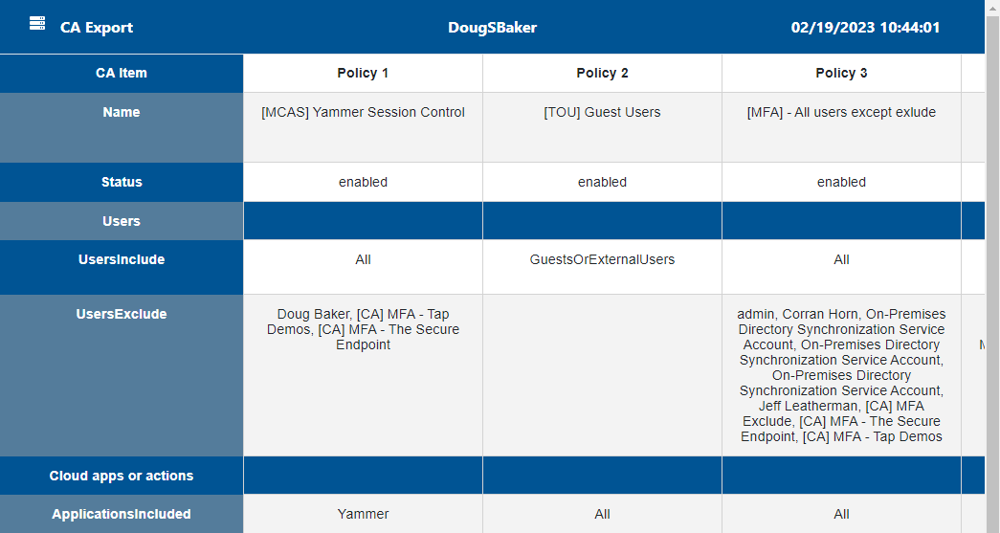

# CA-Export
This tool is designed to help save your CA policys as a html format for external review or documentaion. 

Run the Script using 
```posh
.\Export-CaPolicy.ps1
```

The Script Automically connects to the Graph Module if you are not connected. If you need to change environments you can manually disconnect using the below command. 

```posh
Disconnect-MgGraph 
```
Sample output


## What is new?
This tool has  been updated to version 2.0 so that it maintains support for new features as they come out. 

The old Version will be located here
[Azure AD Version](https://github.com/dougsbaker/CA-Export/blob/main/AzureADVersion/Export-CaPolicy.v1.ps1)

The other Large Change in V2.0 is updateding the styling of the export so it is a little easier to read, and now the selects properly target the whole column. 


### Thanks
Special thanks to Andres Bohren @andresbohren for fixing some issues I had with graph and reminding me to keep my code up to date.  


### License

Its cool to share stuff to make other peoples lives easier, sooo lets keep doing that. 

Shield: [![CC BY-NC-SA 4.0][cc-by-nc-sa-shield]][cc-by-nc-sa]

This work is licensed under a
[Creative Commons Attribution-NonCommercial-ShareAlike 4.0 International License][cc-by-nc-sa].

[![CC BY-NC-SA 4.0][cc-by-nc-sa-image]][cc-by-nc-sa]

[cc-by-nc-sa]: http://creativecommons.org/licenses/by-nc-sa/4.0/
[cc-by-nc-sa-image]: https://licensebuttons.net/l/by-nc-sa/4.0/88x31.png
[cc-by-nc-sa-shield]: https://img.shields.io/badge/License-CC%20BY--NC--SA%204.0-lightgrey.svg
