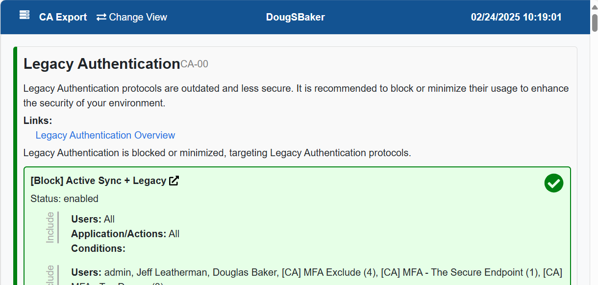
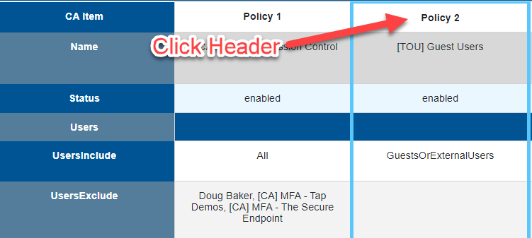

# CA-Export

This tool is designed to help save your CA policies as an HTML format for external review or documentation.

## Run the Script using

### Export-CaPolicy.ps1

This script generates a simple table of your CA policies.

Run the script using:

```posh
.\Export-CaPolicy.ps1
```

The script automatically connects to the Graph Module if you are not connected. If you need to change environments, you can manually disconnect using the command below.

```posh
Disconnect-MgGraph
```

### Export-CAPolicyWithRecs.ps1

This script not only generates a table of your CA policies but also includes recommendations and checks for each policy. It provides detailed insights and suggestions to enhance the security of your Conditional Access policies.

Run the script using:

```posh
.\Export-CAPolicyWithRecs.ps1
```

The script automatically connects to the Graph Module if you are not connected. If you need to change environments, you can manually disconnect using the command below.

```posh
Disconnect-MgGraph
```

#### Recommendations and Checks

The recommendations script checks for the following items:

1. Legacy Authentication
2. MFA Policy targets All Users Group and All Cloud Apps
3. Mobile Device Policy requires MDM or MAM
4. Require Hybrid Join or Intune Compliance on Windows or Mac
5. Require MFA for Admins
6. Require Phish-Resistant MFA for Admins
7. Policy Excludes Same Entities It Includes
8. No Users Targeted in Policy
9. Direct User Assignment
10. Implement Risk-Based Policy
11. Block Device Code Flow
12. Require MFA to Enroll a Device in Intune
13. Block Unknown/Unsupported Devices

Sample output



## What is new?

This tool has been updated to version 2.0 to maintain support for new features as they are released.

The other large change in V2.0 is updating the styling of the export so it is easier to read, and now the selects properly target the whole column.



### License

It's cool to share stuff to make other people's lives easier, so let's keep doing that.

Shield: [![CC BY-NC-SA 4.0][cc-by-nc-sa-shield]][cc-by-nc-sa]

This work is licensed under a
[Creative Commons Attribution-NonCommercial-ShareAlike 4.0 International License][cc-by-nc-sa].

[![CC BY-NC-SA 4.0][cc-by-nc-sa-image]][cc-by-nc-sa]

[cc-by-nc-sa]: http://creativecommons.org/licenses/by-nc-sa/4.0/
[cc-by-nc-sa-image]: https://licensebuttons.net/l/by-nc-sa/4.0/88x31.png
[cc-by-nc-sa-shield]: https://img.shields.io/badge/License-CC%20BY--NC--SA%204.0-lightgrey.svg
